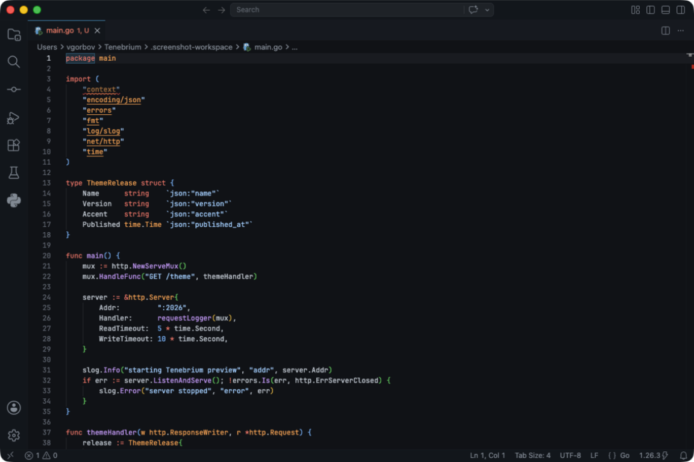

# Tenebrium

Tenebrium is a focused dark theme for developers who like GitHub Dark's deep, blue-tinted surfaces but want the cleaner syntax language of VS Code's 2026 Dark theme.

It keeps the editor calm and low-glare, shifts the workbench accents into a cool teal, and uses the 2026 token palette for familiar, modern syntax highlighting.

## Screenshot



## Highlights

- GitHub-inspired editor and workbench surfaces: `#0d1117`, `#10161d`, and `#161b22`.
- VS Code 2026-style syntax colors for keywords, functions, strings, constants, tags, markup, and diagnostics.
- Teal accents for focus states, activity indicators, buttons, links, selection highlights, and bracket matches.
- Purposefully restrained UI contrast so the editor feels quiet during long coding sessions.

## Install

Search for **Tenebrium** in the VS Code Extensions view, then choose **Color Theme: Tenebrium** from the Command Palette.

For local testing from this repository:

```bash
vsce package
code --install-extension githubdarkplus-4.0.0.vsix
```

## Palette

| Role | Color |
| --- | --- |
| Editor background | `#0d1117` |
| Sidebar and tabs | `#161b22` |
| Title/status surfaces | `#10161d` |
| Primary accent | `#3994BC` |
| Links | `#48A0C7` |
| Cursor | `#BBBEBF` |

## License

Released under the AGPL-3.0 license.
